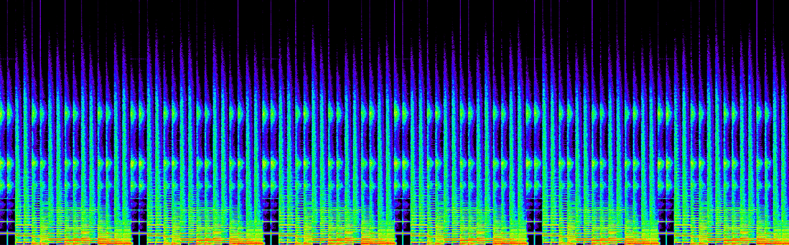

# Лабораторная работа 3. (Spectrogram)

--------------------------

Реализован алгоритм формирования аудио спектрограммы на `CPU` и `GPU`.
Реализация включает в себя использование библиотеки `EasyBMP` для работы с изображениями и `FFTW` для выполнения преобразования Фурье на `CPU`.
Для того, чтобы подключить библиотеку `FFTW` в проект, необходимо было предварительно скомпилировать `.dll` с помощью консоли разработчика VS 
и полученную `.lib` подключить уже в сам проект. Сами библиотеки исключены из системы контроля версий. 


Результат запуска программы:

```
Spectrogram Generator (CPU/GPU)
CUDA устройств: 1
GPU: NVIDIA GeForce RTX 4060 Laptop GPU
Compute capability: 8.9


=== Reading WAV file ===
Sample rate: 44100 Hz
Channels: 1
Bits per sample: 16
Duration: 19 sec
Total samples: 845568

=== FFTW (CPU) Processing ===
1/3 39.4345 ms
2/3 35.305 ms
3/3 35.9296 ms
Average CPU time: 36.8897 ms
Saved: spectrogram_cpu.bmp

=== CUFFT (GPU) Processing ===
1/3 3.06979 ms
2/3 2.90621 ms
3/3 2.96202 ms
Average GPU time: 2.97934 ms
Saved: spectrogram_gpu.bmp

=== Comparison ===
RMSE between CPU and GPU spectrograms: 8.33381e-07

=== Performance Summary ===
FFTW (CPU):  36.8897 ms
CUFFT (GPU): 2.97934 ms
Speedup:     12.3818x

```

По результатам работы алгоритма можно сделать вывод, что алгоритм написанный на `GPU` работает быстрее, чем алгоритм на `CPU` в 12 раз.
Было сделано по 3 запуска для усреднения результатов. Точность вычислений достаточно высокая исходя из сравнения спектрограмм (8.33381e-07).
Ниже представлены спектрограммы, полученные с помощью данной программы

`FFTW`


`CUFFT`

